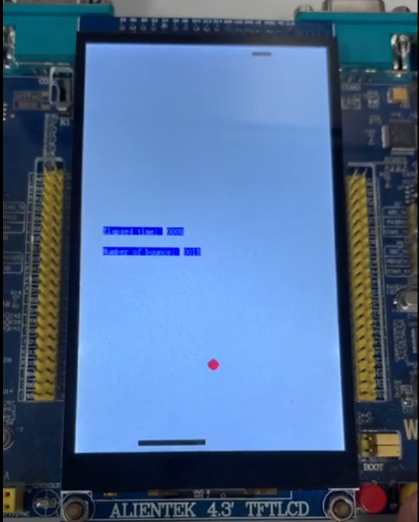

# Bounce

## Introduction
It's a 2-player bouncing ball game on STM32.

## Environment

1. Board: ALIENTEK Warship:
   
   ALIENTEK Warship project board adopts STM32F103ZET6 which is an ARM®-based 32-bit Cortex®-M3 MCU (microcontroller unit). 

2. IDE: [µVision](https://www.keil.com/download/)

   The µVision IDE combines project management, run-time environment, build facilities, source code editing, and program debugging in a single powerful environment.

3. [FlyMcu.exe](http://www.mcuisp.com/software/FlyMcu.rar)

   FlyMcu is used to download the code to the board.

## Result

The sample running result of the program is shown below, or you can check the video file in the [Asset](./Asset) for more details.

